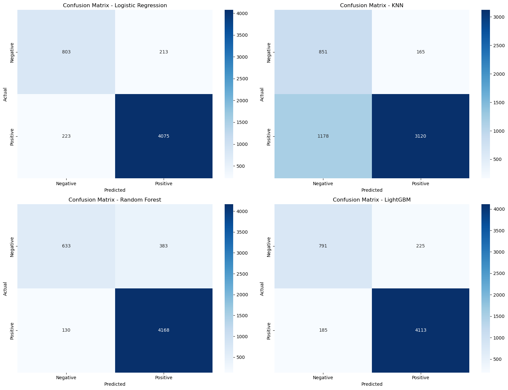
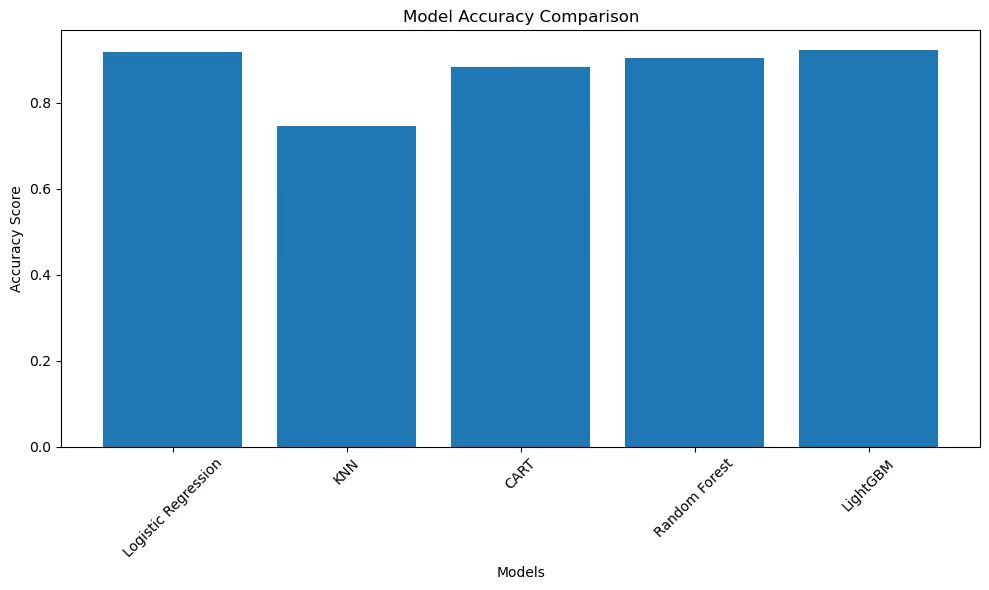

## Sentiment Analysis
#### 1. Importing Libraries
First, we import the necessary libraries. We use `matplotlib` and `seaborn` for data visualization, `sklearn` for machine - learning tasks such as classification, feature extraction, and model evaluation, `numpy` for numerical operations, `lightgbm` for the LightGBM classifier, and `joblib` for saving models.

```python
import matplotlib.pyplot as plt
import seaborn as sns
from sklearn.metrics import confusion_matrix, classification_report
import numpy as np
from sklearn.ensemble import RandomForestClassifier
from lightgbm import LGBMClassifier
from sklearn.metrics import accuracy_score
import joblib
from sklearn.preprocessing import StandardScaler
```
#### 2. Data Preprocessing
The text data needs to be preprocessed before it can be used for analysis. The `preprocess_text` function converts the text to lowercase, removes punctuation, tokenizes the text, removes stop - words, and performs lemmatization.

```python
def preprocess_text(text):
    # Convert to lowercase
    text = text.lower()
    # Remove punctuation
    text = re.sub(r'[^\w\s]', '', text)
    # Tokenize
    tokens = text.split()
    # Remove stop words
    stop_words = set(stopwords.words('english'))
    tokens = [token for token in tokens if token not in stop_words]
    # Lemmatize
    lemmatizer = WordNetLemmatizer()
    tokens = [lemmatizer.lemmatize(token) for token in tokens]
    return ' '.join(tokens)

merged['processed_content'] = merged['cleaned_content'].apply(preprocess_text)
```
#### 3. Sentiment Analysis and Label Generation
We use the `TextBlob` library to perform sentiment analysis on the text. The `get_sentiment` function assigns a 'positive' or 'negative' label based on the polarity of the text.

```python
def get_sentiment(text):
    analysis = TextBlob(text)
    if analysis.sentiment.polarity > 0:
        return 'positive'
    else:
        return 'negative'

merged['sentiment_label'] = merged['cleaned_content'].apply(get_sentiment)
```

#### 4. Label Encoding
We encode the sentiment labels using `LabelEncoder` so that they can be used as target variables in machine - learning models.

```python
label_encoder = LabelEncoder()
merged['sentiment_label_encoded'] = label_encoder.fit_transform(merged['sentiment_label'])
```
#### 5. Feature Extraction and Data Splitting
We use `CountVectorizer` to extract features from the preprocessed text. Then we split the data into training and test sets.

```python
vectorizer = CountVectorizer()
X = vectorizer.fit_transform(merged['processed_content'])
X = X.astype(np.float64)
y = merged['sentiment_label_encoded']
X_train, X_test, y_train, y_test = train_test_split(X, y, test_size=0.2, random_state=42)
```
## Model Comparison
#### 1. Model Training and Evaluation
We define a list of models including Logistic Regression, KNN, CART, Random Forest, and LightGBM. We train each model, make predictions on the test set, calculate the accuracy, and save the confusion matrix and predictions.


```python
models = {
    'Logistic Regression': LogisticRegression(),
    'KNN': KNeighborsClassifier(),
    'CART': DecisionTreeClassifier(),
    'Random Forest': RandomForestClassifier(),
    'LightGBM': LGBMClassifier()
}

results = {}
confusion_matrices = {}
predictions = {}

for model_name, model in models.items():
    model.fit(X_train, y_train)
    y_pred = model.predict(X_test)
    accuracy = accuracy_score(y_test, y_pred)
    results[model_name] = accuracy
    predictions[model_name] = y_pred
    confusion_matrices[model_name] = confusion_matrix(y_test, y_pred)
    print(f'{model_name} accuracy: {accuracy}')
    joblib.dump(model, f'{model_name.replace(" ", "_")}_model.joblib')
```

#### 2. Data Visualization
We use different types of plots to visualize the performance of the models:
- **Bar Chart for Accuracy Comparison**: Compares the accuracy of different models.
```python
plt.figure(figsize=(10, 6))
plt.bar(results.keys(), results.values())
plt.title('Model Accuracy Comparison')
plt.xlabel('Models')
plt.ylabel('Accuracy Score')
plt.xticks(rotation=45)
plt.tight_layout()
plt.show()
```
- **Confusion Matrix Heatmap**: Shows the confusion matrix of the Random Forest model.



```python
plt.figure(figsize=(8, 6))
sns.heatmap(confusion_matrices['Random Forest'], 
           annot=True, 
           fmt='d',
           cmap='Blues',
           xticklabels=['Negative', 'Positive'],
           yticklabels=['Negative', 'Positive'])
plt.title('Confusion Matrix - Random Forest')
plt.xlabel('Predicted')
plt.ylabel('Actual')
plt.show()


```
- **Side - by - Side Bar Chart**: Compares the performance of models based on different metrics (in this case, just accuracy).
```python
metrics = {'Accuracy': results}
df_metrics = pd.DataFrame(metrics)
plt.figure(figsize=(10, 6))
df_metrics.plot(kind='bar')
plt.title('Model Performance Comparison')
plt.xlabel('Models')
plt.ylabel('Score')
plt.xticks(rotation=45)
plt.legend(loc='best')
plt.tight_layout()
plt.show()
```


