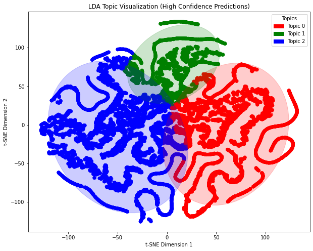
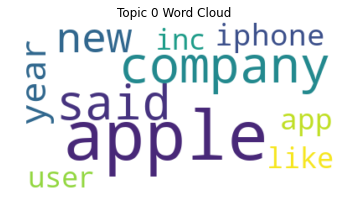
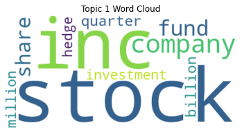
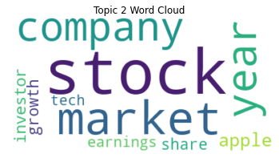
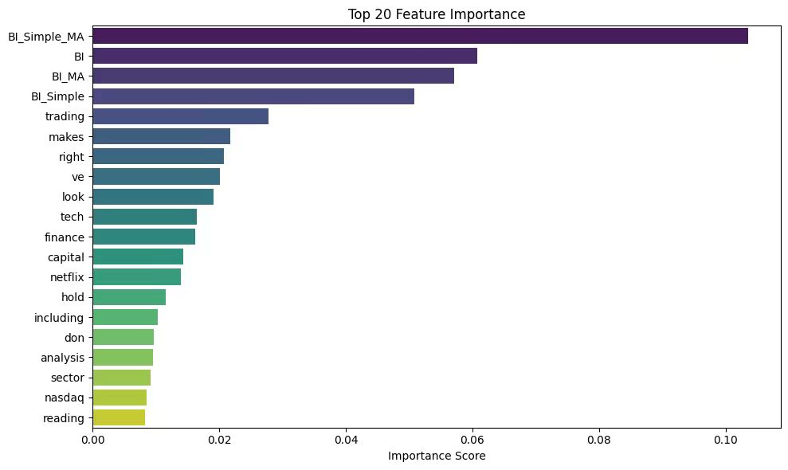
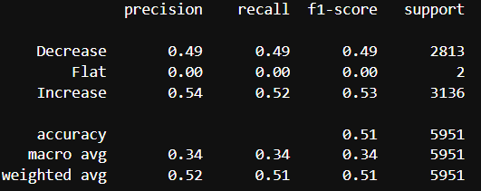
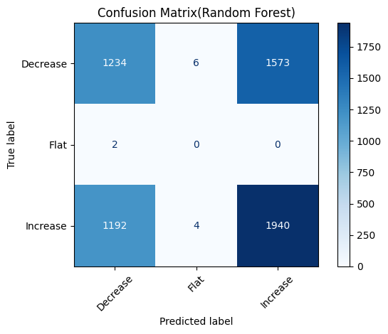
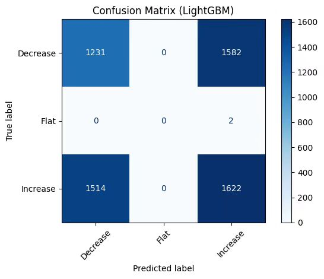
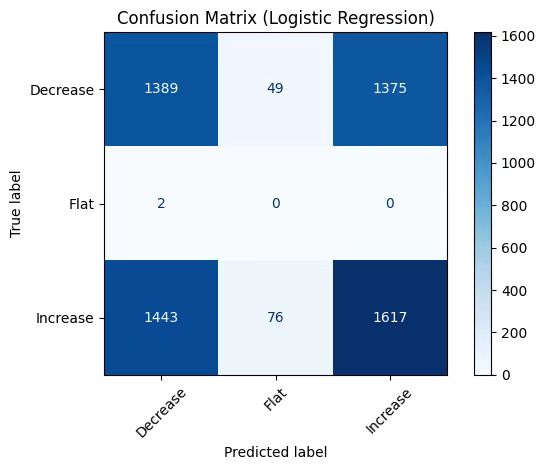

## LDA analysis
The analysis of news texts is performed using LDA topic modeling. First, the texts are preprocessed (lowercasing, removing punctuation, tokenization, lemmatization, and stopword removal). Then, an LDA model is trained to extract 3 topics and retrieve the top 10 keywords for each topic. Next, the topic distribution for each document is calculated, and high-confidence documents (with topic probability > 0.23) are selected and converted into numerical vectors. Finally, t-SNE is applied for dimensionality reduction to map the topic distributions of high-confidence documents into a 2D space, and a scatter plot is used for visualization, with different colors representing different topics, providing an intuitive display of the document clustering based on topics.
#### Code Example:
###### 1.Data Preprocessing:
```python
import pandas as pd
import nltk
from nltk.corpus import stopwords
from nltk.stem import WordNetLemmatizer
import re

# Custom stopwords
custom_stopwords = set(stopwords.words('english')).union({'also', 'u'})

# Text preprocessing function
def preprocess_text(text):
    text = text.lower()  # Convert to lowercase
    text = re.sub(r'[^\w\s]', '', text)  # Remove all non-alphanumeric characters (e.g., punctuation)
    tokens = text.split()  # Split the text into a list of words
    lemmatizer = WordNetLemmatizer()  # Initialize the lemmatizer
    tokens = [lemmatizer.lemmatize(token) for token in tokens]  # Lemmatize words
    tokens = [token for token in tokens if token not in custom_stopwords]  # Remove stopwords
    return tokens

news_df['processed_content'] = news_df['content'].apply(preprocess_text) 
```

###### 2.LDA Modeling:
```python
from gensim import corpora, models
# Create dictionary and corpus
dictionary = corpora.Dictionary(news_df['processed_content'])
corpus = [dictionary.doc2bow(text) for text in news_df['processed_content']]
# Train the LDA model
num_topics = 3  # Set the number of topics
lda_model = models.LdaModel(corpus, num_topics=num_topics, id2word=dictionary, passes=15)
# Extract the top 10 words for each topic
num_words = 10
topic_words = {}
for topic_id in range(num_topics):
    top_words = lda_model.show_topic(topic_id, topn=num_words)
    topic_words[topic_id] = [word for word, _ in top_words]
# Save the topic words as a DataFrame
topic_df = pd.DataFrame(topic_words)
topic_df.columns = [f'Topic {i}' for i in range(num_topics)]
print(topic_df)
```
###### 3.Document Topic Assignment:
```python
from sklearn.manifold import TSNE
import matplotlib.pyplot as plt
import numpy as np
doc_topics = [lda_model.get_document_topics(doc) for doc in corpus]
high_confidence_docs = []
for i, topics in enumerate(doc_topics):
    max_prob = max(topics, key=lambda x: x[1])[1]  
    if max_prob > 0.23: 
        high_confidence_docs.append(i)

high_confidence_probs = [doc_topics[i] for i in high_confidence_docs]
high_confidence_vectors = []
for probs in high_confidence_probs:
    vector = [0] * num_topics
    for topic, prob in probs:
        vector[topic] = prob  
    high_confidence_vectors.append(vector)

high_confidence_vectors = np.array(high_confidence_vectors)

tsne = TSNE(n_components=2, random_state=42)
reduced_vectors = tsne.fit_transform(high_confidence_vectors)
topic_labels = [max(topics, key=lambda x: x[1])[0] for topics in high_confidence_probs]
```

###### 4.t-SNE visualization:

```python
plt.figure(figsize=(10, 8))
scatter = plt.scatter(reduced_vectors[:, 0], reduced_vectors[:, 1], c=topic_labels, cmap='viridis')
legend = plt.legend(*scatter.legend_elements(), title="Topics")
plt.gca().add_artist(legend)
plt.title('LDA Topic Visualization (High Confidence Predictions)')
plt.xlabel('t-SNE Dimension 1')
plt.ylabel('t-SNE Dimension 2')
plt.show()
```



A word cloud is generated and visualized for each LDA topic. First, the code iterates through each topic and retrieves the top `num_words` keywords and their weights, then stores these keywords and their frequencies in a dictionary. Next, the `WordCloud` is used to generate the word cloud, with the size of the words reflecting their importance within the topic. Finally, each topic’s word cloud is displayed using `matplotlib`, helping to visually represent the core vocabulary and its weight within each topic.

#### Code Example:
```python
for topic_id in range(num_topics):
    top_words = lda_model.show_topic(topic_id, topn=num_words)
    word_freq = {word: freq for word, freq in top_words}
    wordcloud = WordCloud(background_color='white').generate_from_frequencies(word_freq)

    plt.figure()
    plt.imshow(wordcloud, interpolation='bilinear')
    plt.axis('off')
    plt.title(f'Topic {topic_id} Word Cloud')
    plt.show()
```









## Stock Price Trend Forecast
In this section, we try to predict the rise and fall trends of stock prices (classified as "rising", "flat", and "falling") through machine learning models, combine sentiment analysis of news texts (sentiment scores and labels) and structured technical indicators (such as BI, BI_MA), build a multimodal feature set, explore the correlation between market sentiment and stock price fluctuations, and ultimately improve prediction accuracy and provide support for investment decisions.
#### 1. Data Preprocessing
The data cleaning phase processed missing values ​​(filled with mean for numerical features and mode for categorical features) and encoded the target variable into numerical form (0, 1, 2). Then, sentiment scores and one-hot encoded sentiment labels were used as sentiment features, and technical indicators (such as BI_MA) were retained as structural features. SMOTE oversampling was used to solve the class imbalance problem, and the data was split in chronological order (80% for training set and 20% for test set) to simulate the real prediction scenario.
###### * Some data preprocessing codes are shown below:
```python
price_related_cols = [
    'DlyPrc', 'DlyRetx', 'DlyVol',
    'DlyClose', 'DlyLow', 'DlyHigh', 'DlyOpen'
]

excluded_cols = [
    'date', 'title', 'content', 
    'HdrCUSIP', 'PERMNO', 'PERMCO', 
    'Ticker', 'sentiment_label'
] + price_related_cols  

features = data.drop(excluded_cols + ['Price_Change'], axis=1)

lags = 3
for col in ['sentiment_score', 'BI', 'BI_Simple']:
    for i in range(1, lags+1):
        features[f'{col}_lag{i}'] = data[col].shift(i)

features = features.iloc[lags:]
y = data['Price_Change'].iloc[lags:]

numeric_cols = features.select_dtypes(include=np.number).columns.tolist()
features[numeric_cols] = features[numeric_cols].fillna(features[numeric_cols].mean())
```
###### * Top 20 Features are as Below :



#### 2. Model Training & Regressing
In the task of predicting stock price fluctuations, we selected three models: Random Forest, LightGBM and Logistic Regression, based on the following considerations: Random Forest can automatically process high-dimensional features, capture complex nonlinear relationships between features, and is suitable for mixed-type data; LightGBM has fast training speed, low memory usage, and supports efficient processing of high-dimensional sparse data (such as TF-IDF text features), which is suitable for optimizing the use of text features; the Logistic Regression model is simple and highly interpretable, and can clearly show the positive/negative impact of features, which is good for verifying the interpretability of sentiment features.
###### * Part of the model training code is as follows (taking the LightGBM model as an example):
```python
model = Pipeline([
    ('preprocessor', preprocessor),
    ('smote', SMOTE(random_state=42)),
    ('classifier', lgb.LGBMClassifier(
        objective='multiclass',  
        num_class=3,            
        boosting_type='gbdt',
        n_estimators=200,
        learning_rate=0.05,
        max_depth=5,
        class_weight='balanced', 
        random_state=42
    ))
])

df = df.sort_values('date').reset_index(drop=True)
X = df[['content', 'sentiment_score', 'sentiment_label', 'BI', 'BI_Simple', 'BI_MA', 'BI_Simple_MA']]
y = df['Price_Change']

train_size = int(len(X)*0.8)
X_train, X_test = X.iloc[:train_size], X.iloc[train_size:]
y_train, y_test = y.iloc[:train_size], y.iloc[train_size:]
model.fit(X_train, y_train)

y_pred = model.predict(X_test)
class_names = le.classes_

print("the report:")
print(classification_report(y_test, y_pred, target_names=class_names))
```
###### * Example of a regression report output:


#### 3. Visualization & Analysis
In the visualization of model results, we use the accuracy comparison chart to intuitively display the performance of each model, use gradient color matching and shadow texture to highlight the significant advantages of the model, and add a 65% baseline to clarify the optimization space; use the prediction probability distribution chart to analyze the model's prediction confidence for each category, explore the confidence interval of the high confidence area, and reveal the ambiguity of the model's classification of intermediate states; use the feature importance chart to reveal the sentiment score and text features, and verify the important contribution of sentiment analysis to stock price prediction. These visualization methods present the model performance in an intuitive and professional way.
###### * Random Forest Model Visualization Results：


###### * LightGBM Model Visualization Results：


###### * Logistic Model Visualization Results：


